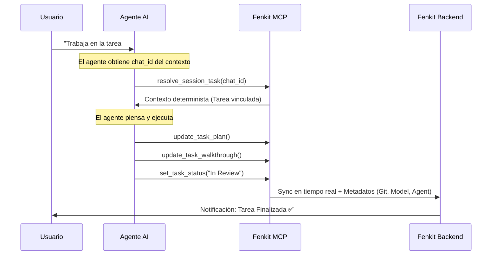

# 🚀 Fenkit MCP - La Infraestructura del "Done"

### **Cero fricción. Máximo control. Sincronización absoluta entre tu Agente AI y tu flujo de trabajo.**

[](https://modelcontextprotocol.io)
[](https://nodejs.org)
[](https://www.npmjs.com/package/fenkit-mcp)
[](LICENSE)
[](https://github.com/DiegoEDG/fenkit-mcp)

Fenkit MCP conecta tus agentes AI con **Fenkit**, tu centro de comando. Transforma SDD en progreso real y documentación estructurada sin mover un solo dedo.

---

## 🌪️ El Loop del Éxito: Auto-Invoke

Olvida el copiar y pegar. Fenkit MCP implementa un ciclo de vida autónomo donde el agente no solo "hace", sino que **reporta y documenta**.



---

## ⚡ Activación en 30 Segundos

Despliega el poder de Fenkit en tu cliente favorito con un solo comando. Ahora con el alias `fnk` disponible.

```bash
npx -y fenkit-mcp setup <client>
```

| Cliente | Comando de Setup |
| :--- | :--- |
| **OpenCode** | `npx -y fenkit-mcp setup opencode` |
| **Claude Code** | `npx -y fenkit-mcp setup claudecode` |
| **Claude Desktop** | `npx -y fenkit-mcp setup claude` |
| **GPT Codex** | `npx -y fenkit-mcp setup codex` |
| **Cursor** | `npx -y fenkit-mcp setup cursor` |
| **Windsurf** | `npx -y fenkit-mcp setup windsurf` |
| **Antigravity** | `npx -y fenkit-mcp setup antigravity` |

---

## ⚖️ ¿Por qué Fenkit MCP?

| Característica | Prompting Manual | Con Fenkit MCP |
| :--- | :--- | :--- |
| **Orientación** | Manual / Olvidos | **Determinista** (`resolve_session_task`) |
| **Contexto** | Fragmentado | Siempre sincrónico |
| **Documentación** | "Luego lo escribo" | Automática: Plan + Walkthrough |
| **Metadatos** | Inexistentes | Git, Model, Agent, Tokens |
| **Visibilidad** | Caja negra | Métricas y progreso en vivo |
| **Esfuerzo** | Alto (Copy-Paste) | **Cero** (Auto-invoke) |

---

## 📦 El Valor del "Dev-in-the-loop"

Fenkit permite que el desarrollador se enfoque en lo que realmente aporta valor: el **Spec Driven Development (SDD), Testing, Seguridad, etc**. Deja que el agente construya mientras Fenkit gestiona la burocracia técnica.

Al eliminar el caos administrativo, Fenkit genera de forma autónoma:

- **📈 Métricas de ejecución:** Seguimiento en tiempo real de versiones y tiempos de ejecución.
- **🛡️ Evidencia:** Documentación centralizada y lista para auditorías o revisiones de equipo.
- **🔁 Sincronización Total:** Tu código y tu panel de control siempre en la misma página, sin copy-paste.

---

## 🧰 Herramientas

Nuestras herramientas están diseñadas para que el agente tenga autonomía total:

- 🔐 **Auth/Admin:** `login`, `get_status`, `setup_client` - Seguridad y configuración.
- 📂 **Proyectos:** `list_projects`, `select_project` - Navegación inteligente.
- 📝 **Tareas:** `list_tasks`, `get_task_context_compact` - Foco en lo que importa.
- 🚀 **Escritura:** `update_task_plan`, `update_task_walkthrough`, `set_task_status` - Documentación y lifecycle determinista.

---

## 🔥 Empieza Ahora

No dejes que tu agente trabaje en el vacío. Haz que cada línea de código cuente.

```bash
npx -y fenkit-mcp setup cursor
```

***

## 🛠️ Desarrollo Local

Si estás trabajando en el backend localmente y quieres que el MCP se conecte a tu instancia de desarrollo (`localhost:3000`), simplemente inicia el servidor MCP con la bandera:

```bash
FENKIT_LOCAL=true
```

Esto cambiará automáticamente todos los endpoints a `localhost` sin necesidad de reconfigurar nada.

**Haz que tu agente construya. Deja que Fenkit lo demuestre.**
